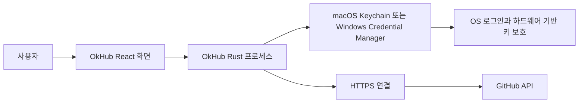
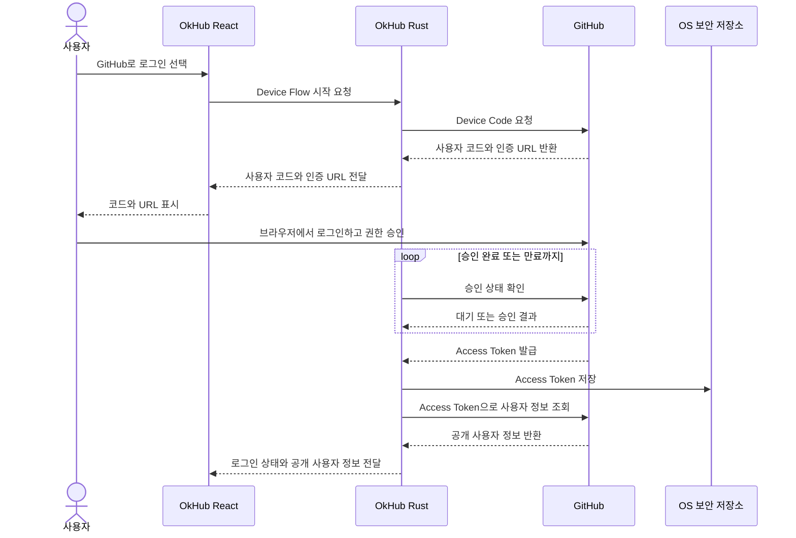
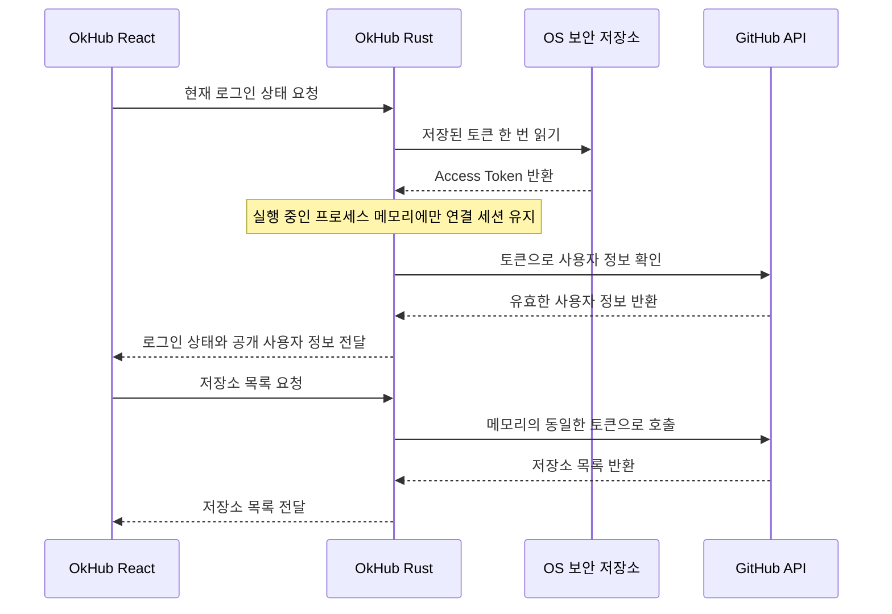

# GitHub 권한 위임과 OS 보안 저장소

이 문서는 OkHub의 GitHub 연결, 토큰 보관과 앱 재실행 시 연결 세션 복원 흐름을 설명합니다. 비밀번호와 토큰을 직접 다루는 데 익숙하지 않은 개발자도 전체 구조부터 이해할 수 있도록 작성합니다.

## 먼저 구분할 것

### 인증과 인가

- **인증(Authentication)**: 사용자가 누구인지 확인합니다.
- **인가(Authorization)**: 확인된 사용자나 앱이 어떤 작업을 할 수 있는지 결정합니다.

OkHub에서 사용자는 GitHub에서 본인 계정으로 로그인합니다. 사용자가 권한을 승인하면 GitHub는 OkHub가 허용된 범위에서 GitHub API를 호출할 수 있는 Access Token을 발급합니다.

이때 인증과 인가를 담당하는 주체가 다릅니다.

```text
GitHub
└─ 비밀번호, Passkey 또는 2FA로 사용자를 인증

OkHub
└─ 사용자를 직접 인증하지 않음
   └─ OAuth 2.0으로 GitHub API 접근 권한을 위임받음
```

### OAuth 2.0과 OIDC

현재 OkHub가 사용하는 방식은 **GitHub App의 OAuth 2.0 Device Flow**입니다. OIDC가 아닙니다.

- OAuth 2.0은 애플리케이션이 사용자를 대신해 API에 접근할 권한을 위임받는 체계입니다.
- OIDC(OpenID Connect)는 OAuth 2.0 위에 사용자 인증 정보를 표준화해 추가한 계층입니다. 일반적으로 `openid` scope와 ID Token을 사용합니다.
- OkHub는 Device Flow로 Access Token을 받고 GitHub API를 호출합니다. GitHub 사용자 정보가 필요하면 Access Token으로 GitHub API를 조회합니다. 현재 `openid` scope나 ID Token을 사용하지 않으므로 OIDC라고 부르지 않습니다.

GitHub Actions가 클라우드 제공자에 배포할 때 사용하는 GitHub OIDC와도 별개의 기능입니다.

### OkHub에 자체 인증이 필요한가

현재 제품 범위에서는 OkHub 자체 계정과 인증 시스템이 필요하지 않습니다.

| 필요하지 않은 것 | 필요한 것 |
|---|---|
| OkHub 회원가입 | GitHub에서 사용자 인증 |
| OkHub 비밀번호 | GitHub OAuth 권한 승인 |
| OkHub 인증 서버 | GitHub Access Token 보관 |
| OkHub 사용자 DB | Access Token으로 GitHub API 호출 |
| OkHub 세션 쿠키 | 연결된 GitHub 사용자 정보 표시 |

공개 저장소와 로컬 문서만 읽는 기능은 GitHub 연결 없이 제공할 수 있습니다. 하지만 비공개 저장소, 조직 저장소, Issue, PR, 댓글과 리뷰를 사용하려면 GitHub OAuth 권한 승인이 필요합니다.

화면에서는 사용자에게 익숙한 `GitHub로 로그인`이라는 표현을 사용할 수 있습니다. 기술 문서에서는 다음과 같이 표현합니다.

> OkHub는 자체 사용자 인증 시스템을 운영하지 않습니다. 사용자는 GitHub에서 인증되며, OkHub는 OAuth 2.0 Device Flow로 GitHub API 접근 권한을 위임받습니다. 연결된 사용자 정보는 Access Token으로 GitHub API를 조회해 표시합니다.

## 전체 보안 구조



각 계층의 역할은 다음과 같습니다.

| 계층 | 책임 |
|---|---|
| 사용자·GitHub | 사용자의 신원을 확인하고 요청한 권한을 승인합니다. |
| React 화면 | 로그인 상태와 사용자 정보를 표시합니다. 토큰은 받지 않습니다. |
| Rust 프로세스 | Device Flow, 토큰 사용, GitHub API 호출과 GitHub 연결 세션을 담당합니다. |
| 운영체제 | 토큰을 암호화된 Keychain 또는 Credential Manager에 장기 보관하고 접근 정책을 적용합니다. |
| 하드웨어 | OS가 사용하는 암호화 키와 잠금 상태를 더 낮은 수준에서 보호합니다. |
| 네트워크 | HTTPS로 통신 내용을 암호화하고 연결 상대가 GitHub인지 인증서로 확인합니다. |

## 운영체제 계층과 하드웨어 계층

운영체제 계층은 앱이 직접 암호화 저장소를 구현하지 않도록 **보안 금고 서비스**를 제공합니다. macOS에서는 Keychain이 이 역할을 합니다.

```text
OkHub: "이 토큰을 안전하게 보관해 줘"
  ↓
Keychain: 토큰 암호화·저장, 접근 가능한 앱과 조건 관리
  ↓
디스크: 암호화된 데이터만 저장
```

OkHub는 GitHub 토큰을 일반 설정 파일이나 OKF 저장소에 기록하지 않습니다. 나중에 토큰이 필요하면 Keychain API를 호출합니다. Keychain은 현재 사용자가 잠금을 해제했는지, 요청한 프로세스가 해당 항목에 접근할 수 있는지 등을 확인합니다. macOS에서는 코드 서명이 앱을 식별하는 근거 중 하나가 됩니다.

하드웨어 계층은 금고의 내용보다 **금고를 잠그는 핵심 열쇠**를 보호하는 역할에 가깝습니다. Apple Silicon Mac의 Secure Enclave 같은 보안 하드웨어는 OS 로그인과 암호화 키 보호 체계에 관여합니다.

```text
GitHub Access Token
  └─ Keychain 데이터베이스에 암호화되어 저장
       └─ 암호화에 필요한 키를 OS가 관리
            └─ 핵심 키와 잠금 상태를 보안 하드웨어가 보호
```

따라서 “GitHub 토큰 문자열이 항상 Secure Enclave 내부에 직접 저장된다”는 의미는 아닙니다. Keychain 데이터는 디스크에 암호화되어 저장되고, OS와 지원되는 하드웨어가 이를 해독하는 키와 접근 조건을 보호합니다.

## 최초 GitHub 연결 흐름



이 과정에서 역할이 다른 값은 다음과 같습니다.

| 값 | 의미 | 비밀 여부 |
|---|---|---|
| Client ID | GitHub에 등록된 OkHub 앱을 식별합니다. | 공개 식별자 |
| 사용자 코드 | 사용자가 Device Flow 승인 화면에 입력합니다. | 짧은 수명, 화면 노출 가능 |
| Device Code | OkHub가 승인 상태를 확인할 때 사용합니다. | 짧은 수명, 앱 내부에서만 사용 |
| Access Token | 승인된 권한으로 GitHub API를 호출합니다. | 비밀, OS 보안 저장소에 보관 |

## 다음 실행부터의 정상적인 흐름

앱을 다시 실행할 때 GitHub 로그인을 반복하는 대신, Rust 프로세스가 OS 보안 저장소에서 토큰을 한 번 읽어 GitHub 연결 세션을 복원합니다.



여기서 메모리 연결 세션은 다음을 의미합니다.

- 토큰은 Tauri의 Rust 프로세스 메모리에만 존재합니다.
- React에는 로그인 여부, 사용자명과 프로필 이미지 같은 공개 세션 정보만 전달합니다.
- 실행 중 GitHub API 요청은 메모리의 토큰을 재사용합니다.
- 앱을 종료하면 프로세스 메모리의 토큰도 사라집니다.
- 다음 실행에서는 Keychain에서 다시 한 번 읽습니다.
- 로그아웃하면 메모리 세션과 Keychain 항목을 모두 삭제합니다.

Keychain은 앱을 종료해도 유지되는 장기 보관함이고, Rust 프로세스 메모리는 앱을 실행하는 동안만 사용하는 작업 공간입니다.

## 반복되는 Keychain 접근 문제

GitHub API 요청마다 Keychain에서 토큰을 다시 읽으면 하나의 사용자 행동이 여러 API 요청으로 나뉠 때 Keychain 확인 창도 반복될 수 있습니다. 개발 빌드가 ad-hoc 서명되어 재빌드 후 앱의 코드 서명 신원이 안정적으로 유지되지 않는 점은 이 현상을 더 눈에 띄게 만들 수 있습니다.

목표 구조는 다음과 같습니다.

1. Rust 프로세스가 최초 GitHub 연결 상태 확인 시 Keychain을 한 번 읽습니다.
2. 동시에 여러 요청이 시작되어도 하나의 초기화 작업만 Keychain에 접근합니다.
3. 실행 중에는 메모리 연결 세션의 토큰을 재사용합니다.
4. 토큰 갱신 시 메모리와 Keychain을 함께 갱신합니다.
5. 로그아웃 시 메모리와 Keychain을 함께 비웁니다.
6. React에는 토큰을 노출하지 않습니다.

## 참고 자료

- [GitHub OAuth App의 Device Flow](https://docs.github.com/en/apps/oauth-apps/building-oauth-apps/authorizing-oauth-apps#device-flow)
- [GitHub OAuth App 권한과 Scope](https://docs.github.com/en/apps/oauth-apps/using-oauth-apps/authorizing-oauth-apps)
- [OpenID Connect Core 1.0](https://openid.net/specs/openid-connect-core-1_0.html)
- [Apple Keychain Services](https://developer.apple.com/documentation/security/keychain-services)
- [Apple Keychain data protection](https://support.apple.com/guide/security/keychain-data-protection-secb0694df1a/web)
- [Apple Code Signing Services](https://developer.apple.com/documentation/security/code-signing-services)
