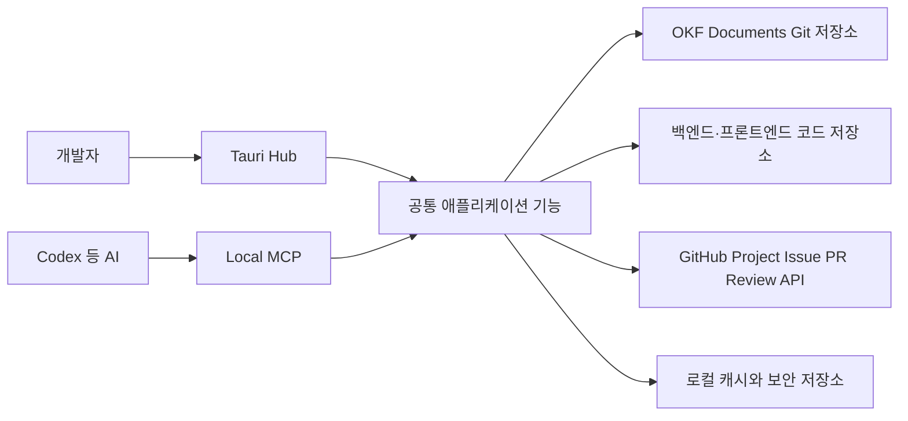

# 기술 구조

이 문서는 현재 제품 방향을 만족하기 위한 기술 구조 후보를 정리합니다. 구현 기술의 세부 선택은 설계 승인 후 확정합니다.

## 전체 구성

Hub UI와 MCP가 파일을 서로 다른 방식으로 직접 수정하지 않고, 같은 애플리케이션 기능과 검증 규칙을 사용하도록 설계합니다.

## 저장소 구성

### 앱 저장소

`okf-knowledge-hub` 자체 코드와 제품 문서를 관리합니다.

### 프로젝트 문서 저장소

각 실제 프로젝트의 OKF Markdown, 문서 템플릿과 지식 이력을 관리합니다. 앱 저장소와 분리해 Hub 없이도 Git, Codex와 다른 도구가 읽을 수 있도록 합니다.

### 코드 저장소

백엔드와 프론트엔드 저장소를 워크스페이스에 연결합니다. 하나의 문서 저장소가 여러 코드 저장소와 연결될 수 있습니다.

## 공유 원본

| 정보 | 공유 원본 |
|---|---|
| 확정된 문서 | 기본 브랜치의 OKF Markdown |
| 검토 중인 문서 변경 | Git 브랜치와 커밋 |
| 리뷰 댓글과 승인 상태 | GitHub PR/Issue |
| 구현 코드 | 연결된 코드 저장소 |
| 진행판 | 워크스페이스에 연결된 GitHub Project |
| 구현 작업 | GitHub Issue와 연결된 PR |
| API 계약 | OpenAPI Git 원본 후보 |
| UI 캐시·최근 목록·미전송 작업 | 로컬 SQLite |
| GitHub 인증 정보 | OS 보안 저장소 |

중앙 데이터베이스가 없더라도 GitHub가 팀 공유 리뷰 상태를 보관합니다. 로컬 SQLite는 삭제 후 다시 구축할 수 있는 캐시와 outbox로 사용하며 팀 공유 원본으로 사용하지 않습니다.

기본적으로 하나의 워크스페이스에 하나의 GitHub Project를 연결합니다. Project는 여러 코드 저장소의 Issue와 PR을 모으는 계획·진행 화면이며, 실제 작업 데이터는 Issue와 PR에 남깁니다. 초기에는 Project의 Draft Issue를 공유 원본으로 사용하지 않습니다.

## 인증

- GitHub Device Flow 후보
- 사용자 비밀번호 저장 금지
- 토큰은 macOS Keychain, Windows Credential Manager 등 OS 보안 저장소에 저장
- 워크스페이스 설정이나 문서 저장소에 인증 정보 기록 금지

## 문서 편집

### 사람용 화면

- 리치 문서 편집
- 구조화된 속성 폼
- Mermaid 전용 블록
- API·코드·Issue 연결 선택기
- 상태와 리뷰 요청 UI

### 원본과 검증

- OKF Markdown과 frontmatter
- Markdown 원문 모드
- 스키마 검증
- Git diff와 렌더링 비교

현재 편집기 후보는 리치 편집에 MDXEditor, 원문과 diff에 CodeMirror를 조합하는 방식입니다.

## 리뷰 저장 흐름

1. 기본 브랜치 문서를 기준으로 변경 제안 브랜치를 만듭니다.
2. 수정된 문서와 Mermaid를 브랜치에 커밋합니다.
3. GitHub PR을 리뷰 컨테이너로 사용합니다.
4. 일반 논의와 줄 단위 댓글은 GitHub 리뷰 객체로 저장합니다.
5. Hub는 GitHub 화면 대신 문서 중심 UI로 이를 렌더링합니다.
6. 승인 후 병합되면 기본 브랜치의 확정 문서가 갱신됩니다.
7. 장기 보존이 필요한 결정만 문서 또는 별도 결정 기록으로 반영합니다.

선택형 응답을 GitHub에 어떤 구조로 저장할지는 미결정입니다. PR 본문·댓글의 구조화된 메타데이터, GitHub Issue 기반 방식 등을 비교해야 합니다.

## API 문서 전략

### 추천 후보

- 설계 우선 OpenAPI 파일을 Git에 저장합니다.
- Hub는 OpenAPI를 읽기 쉬운 API Catalog로 렌더링합니다.
- OKF 처리 케이스는 API 내용을 복사하지 않고 `operationId`로 참조합니다.
- Postman은 필요할 때 OpenAPI에서 Collection을 생성해 호출·테스트에 사용합니다.

### 이유

- OKF와 OpenAPI에 요청·응답 스키마를 중복 작성하지 않습니다.
- API 계약을 브랜치와 PR로 리뷰할 수 있습니다.
- Postman을 유일한 원본으로 둘 때 생기는 추가 플랫폼 의존을 줄입니다.
- Mock, 검증, 클라이언트 생성 등 OpenAPI 생태계를 활용할 수 있습니다.

### 확인할 사항

- 현재 백엔드가 Springdoc/Swagger 코드 기반 자동 생성인지
- 직접 작성한 OpenAPI YAML이 있는지
- Postman Collection만 관리하는지
- OpenAPI 파일을 문서 저장소와 백엔드 저장소 중 어디에 둘지

## 코드 탐색

- 연결된 저장소의 파일과 심볼 검색
- 브랜치·커밋·PR별 코드와 diff 조회
- 문서의 `code_refs`에서 코드로 이동
- 코드에서 관련 문서와 처리 케이스를 역색인
- 실제 수정, 실행과 디버깅은 IDE에서 수행

## MCP

### 목적

Codex 같은 외부 AI가 Hub의 구조를 이해하고 문서화와 진행 상태 변경을 안전하게 수행하도록 합니다.

### 읽기 도구 후보

- 워크스페이스와 최근 활동 조회
- 기능·시나리오·처리 케이스 조회
- 문서와 관련 코드 검색
- 대기 중인 리뷰와 작업 조회
- 특정 문서의 history와 diff 조회

### 쓰기 도구 후보

- 문서 초안 작성과 수정
- Mermaid 블록 갱신
- 상태 변경
- 코드·API·Issue 참조 연결
- 리뷰 요청 생성
- 변경 diff 생성

### 안전 원칙

- 읽기와 쓰기 도구를 구분합니다.
- 모든 쓰기는 OKF와 도메인 스키마를 검증합니다.
- AI 변경은 먼저 로컬 또는 제안 브랜치에 저장합니다.
- push, merge, 삭제, 승인과 Issue 종료는 사용자 확인을 요구합니다.
- Hub UI와 MCP가 같은 도메인 명령을 사용합니다.

## 참고 자료

- [OKF FAQ](https://okf.md/faq/)
- [OpenAPI Specification](https://spec.openapis.org/oas/v3.2.0.html)
- [Postman과 OpenAPI 연동](https://learning.postman.com/docs/integrations/available-integrations/working-with-openAPI)
- [Postman API Builder의 Git 연동](https://learning.postman.com/v11/docs/design-apis/api-builder/versioning-an-api/using-cloud-git-repo)
- [Codex MCP 연결](https://learn.chatgpt.com/docs/extend/mcp#connect-codex-to-an-mcp-server)
