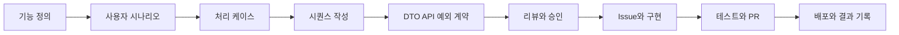

# 유스케이스와 작업 흐름

화면보다 먼저 실제 사용자가 언제, 무엇을 해결하기 위해 Hub를 사용하는지 정의합니다.

## 사용자 역할

| 역할 | 설명 |
|---|---|
| 작성자 | 설계, 변경 제안, 질문 또는 작업 상태를 작성하는 개발자 |
| 검토자 | 관련 맥락을 읽고 댓글, 선택, 승인 또는 수정 요청을 남기는 개발자 |
| Git/GitHub | 문서, 코드, Issue, PR과 협업 이력을 공유하는 외부 시스템 |
| AI 도구 | MCP를 통해 문서 조회, 초안 작성과 상태 변경을 돕는 선택적 사용자 |

## UC-00. 최초 실행에서 워크스페이스를 연결한다

1. 사용자가 GitHub에 로그인합니다.
2. 기존 OKF 지식 저장소를 선택하거나 새 저장소를 초기화합니다.
3. Hub가 저장소의 `.okf/workspace.yml`을 읽고 문서 루트, 연결된 코드 저장소와 GitHub Project 설정을 검증합니다.
4. 사용자 기기의 저장소 경로와 UI 설정은 로컬 설정 파일에 저장하고, 인증 정보는 OS 보안 저장소에 보관합니다.
5. 연결이 완료되면 단일 워크스페이스의 Home을 엽니다.

이 흐름은 최초 연결이나 연결 복구 시에만 사용합니다. 평소 앱에는 최근 워크스페이스 목록과 워크스페이스 전환 화면이 없습니다.

## UC-01. 개발 중 확인이 필요한 상황

최초 불편 사항에 가장 가까운 핵심 유스케이스입니다.

### 시작 조건

개발 중 추가 요구사항, 애매한 동작, API 계약 변경 또는 여러 설계 선택지가 발견됩니다.

### 기본 흐름

1. 작성자가 현재 작업 중인 기능 또는 처리 케이스를 엽니다.
2. 관련 문서, 코드, API 작업과 현재 브랜치를 선택합니다.
3. 질문, 변경 이유, 영향 범위와 선택지를 작성합니다.
4. 확정 문서를 직접 바꾸지 않고 변경 제안 브랜치를 생성합니다.
5. 변경된 문서나 Mermaid와 기존 내용을 비교하는 리뷰 요청을 만듭니다.
6. 검토자는 자신의 시간에 고정 링크를 열고 다음 중 필요한 방식으로 확인합니다.
   - 변경이 반영된 렌더링 제안 문서
   - `+ / -`가 표시된 줄 단위 diff
   - 렌더링된 Before와 After 문서 비교
7. 검토자는 문장, diff 줄 또는 Mermaid·표·코드 블록 전체를 선택해 댓글이나 단일 선택 결정 요청을 연결합니다. 선택하지 않으면 문서 전체 의견으로 남깁니다.
8. 검토자는 승인 또는 수정 요청을 남깁니다.
9. 수정 요청이 있으면 작성자가 같은 변경 제안을 갱신합니다.
10. 승인되면 PR을 병합하고 기본 브랜치의 확정 문서를 갱신합니다.
11. 구현 작업과 상태가 연결되고 개발을 계속합니다.

### 결과

- 최종 문서는 승인된 내용만 포함합니다.
- 검토 대화는 GitHub PR/Issue에 남습니다.
- 구조화된 결정 요청과 응답은 GitHub PR 댓글에 연결하고 최종 결정만 OKF history 또는 문서 본문에 반영합니다.
- 장기적으로 중요한 결정만 문서 본문 또는 결정 기록으로 승격합니다.

## UC-02. 기능을 설계하고 구현한다

진행 상태는 사용자 시나리오 수준에서 요약하고, 시퀀스·계약·구현과 테스트의 세부 상태는 필요한 처리 케이스와 문서에 연결하는 방향을 우선 검토합니다.

## UC-03. 나중에 접속해 상황을 파악한다

1. 앱을 열면 연결된 단일 워크스페이스의 Home이 바로 열립니다.
2. 지난 접속 이후 변경된 내용과 최근 활동을 확인합니다.
3. 진행 중, 막힘, 응답 대기와 완료 항목을 확인합니다.
4. 자신이 처리할 리뷰나 의사결정 요청을 선택합니다.
5. 관련 문서, 코드, 변경 이력과 대화를 한 흐름에서 확인합니다.
6. 필요한 응답이나 상태 변경을 수행합니다.

Home과 타임라인은 이 유스케이스를 지원하는 화면입니다. Home 자체가 제품의 목적은 아닙니다.

## UC-04. 문서와 관련 코드를 함께 탐색한다

1. 기능, 처리 케이스 또는 문서를 엽니다.
2. 연결된 백엔드·프론트엔드 파일, 심볼, 커밋과 PR을 확인합니다.
3. Hub 안에서 코드를 읽고 검색하고 diff를 확인합니다.
4. 코드에서 연결된 설계, API 작업과 결정으로 역방향 이동합니다.
5. 코드 수정과 실행이 필요하면 IDE에서 해당 위치를 엽니다.

문서와 코드는 안정적인 ID와 `code_refs` 같은 참조를 통해 다대다로 연결합니다.

## UC-05. 분석과 테스트 결과를 남긴다

1. 성능 병목, 기술 조사, 실험 또는 테스트 필요성을 발견합니다.
2. 적절한 문서 템플릿으로 분석 계획과 기준을 작성합니다.
3. 관련 기능, 처리 케이스, 코드, API, Issue와 커밋을 연결합니다.
4. 결과와 후속 작업을 기록합니다.
5. 리뷰가 필요하면 변경 제안 흐름을 사용합니다.

이 문서는 제품 구조 트리의 하위 단계가 아니라 여러 대상에 연결되는 독립 문서 자료입니다.

## UC-06. AI가 문서화와 진행 상태를 돕는다

1. 사용자가 Codex에 현재 진행 상황 정리 또는 문서 초안 작성을 요청합니다.
2. Codex가 로컬 MCP를 통해 워크스페이스와 관련 문맥을 읽습니다.
3. Codex가 문서 또는 상태 변경 초안을 생성합니다.
4. 사용자가 Hub에서 diff를 확인합니다.
5. 공유 또는 Git push 같은 외부 변경은 사용자가 명시적으로 승인합니다.

MCP는 AI 모델을 내장하는 기능이 아니라 외부 AI가 Hub의 도메인 작업을 안전하게 호출할 수 있게 하는 인터페이스입니다.

## UC-07. 문서 변경 작업을 안전하게 시작하고 종료한다

전체 흐름은 [문서 변경 워크플로](workflow.html)에서 다이어그램과 함께 확인합니다.

### 문서 식별

- 새 문서를 만들 때 UUID v4 기반의 `okf_hub_id`를 frontmatter에 발급합니다.
- 문서 ID는 제목이나 Git 파일 경로가 바뀌어도 유지하며 문서 잠금과 이력 추적에 사용합니다.
- ID가 없는 기존 문서는 읽을 수 있고, 처음 편집하는 변경 작업에서 ID를 추가합니다.
- 문서를 복제하면 원본 ID를 복사하지 않고 새 ID를 발급합니다.

### 기존 문서 변경

1. Hub가 문서 ID를 기준으로 열린 `okf-document-change` Issue를 확인합니다.
2. 잠금이 없으면 문서 변경 Issue를 만들고 Assignee 한 명을 현재 편집자로 지정합니다.
3. Issue 생성 후 열린 Issue를 다시 확인해 잠금 경쟁에서 이겼는지 검증합니다.
4. 잠금을 확보한 뒤 변경 목적 단위 branch와 독립 worktree를 만듭니다.
5. 편집 내용은 로컬 파일에 자동 저장하고, 의미 있는 작업 구간과 검수 요청 전에 commit·push합니다.
6. 중간 검수가 필요하면 Draft PR을 만들고 같은 PR에서 댓글, 결정, 수정과 재검수를 반복합니다.
7. 최종 확인 시 같은 PR을 Ready for review로 전환하고, 승인 뒤 Squash merge합니다.
8. 병합과 최종 동기화를 확인한 뒤 Issue를 닫아 잠금을 해제하고 worktree와 작업 branch를 정리합니다.

하나의 문서 변경 Issue는 관련 문서 여러 개를 포함할 수 있지만 현재 편집자는 한 명입니다. 문서 중 하나라도 다른 변경 작업에 잠겨 있으면 전체 잠금 확보를 실패시킵니다. 현재 편집자가 아닌 사용자는 읽기, 댓글, 결정 응답, Draft PR 검수와 편집권 요청을 할 수 있습니다.

### 새 문서 변경

- 새 문서는 기존 잠금이 없으므로 Issue 없이 개인 초안 branch와 worktree에서 바로 시작할 수 있습니다.
- branch 이름에는 소유자와 생성된 change ID를 포함해 다른 기기에서 같은 사용자가 이어갈 수 있게 합니다.
- 단순 검수는 Issue 없이 Draft PR을 만들 수 있습니다.
- 다른 개발자에게 편집권을 넘길 필요가 생기면 기존 branch와 PR에 문서 변경 Issue를 추가로 연결합니다.
- 같은 Git 경로에 다른 새 문서가 생기면 경로 충돌을 해결한 뒤 병합합니다.

### 편집권 이전

1. 요청자는 문서 변경 Issue에 이유와 대상 문서를 포함한 구조화된 댓글을 남깁니다.
2. 현재 편집자는 편집권 이전, 검수자로 참여 요청 또는 거절 중 하나를 선택합니다.
3. 편집권을 넘기면 현재 변경을 checkpoint commit·push하고 원격 동기화와 clean 상태를 확인합니다.
4. 현재 기기의 기존 worktree를 정리합니다. 동기화되지 않은 변경이나 정리 오류가 있으면 이전을 중단하고 Assignee를 유지합니다.
5. 기존 worktree 정리가 끝난 뒤 Issue Assignee를 요청자로 바꿉니다.
6. 요청자는 같은 branch를 자신의 기기에 새 worktree로 가져와 작업을 이어갑니다.
7. 기존 편집자는 Hub에서 해당 문서를 읽기·검수 모드로만 사용합니다. 다른 기기에 남은 worktree도 Assignee 불일치를 감지하면 편집과 push를 허용하지 않습니다.
8. 기존 Draft PR이 있다면 새로 만들지 않고 그대로 사용합니다.

같은 문서는 worktree가 달라도 한 시점에 한 명만 편집할 수 있습니다. 서로 다른 문서는 각자의 변경 branch와 worktree에서 동시에 편집할 수 있습니다. Hub 밖에서 Git을 직접 수정하는 것까지 기술적으로 차단하지는 못하므로 이 규칙은 Issue Assignee를 원본으로 삼는 소프트 잠금입니다.

### 오프라인 초안과 재연결

- 오프라인에서도 어떤 문서든 현재 기기의 로컬 worktree에 편집할 수 있습니다.
- 오프라인 초안은 원격 잠금을 소유한 것으로 간주하지 않으며 `document_id`, `base_commit`, 로컬 worktree와 시작 시각을 기기별 설정에 보관합니다.
- 온라인으로 돌아오면 현재 main, 열린 문서 변경 Issue와 같은 사용자의 원격 branch를 조회한 뒤 공유 여부를 결정합니다.
- 다른 편집자가 잠금을 소유하면 로컬 초안을 보존하고 push하지 않습니다. 사용자는 편집권 요청, 변경 전달, 로컬 유지 또는 명시적 폐기를 선택합니다.
- 잠금이 없고 main이 그대로면 잠금을 확보한 뒤 branch와 checkpoint를 원격에 공유합니다.
- main이 변경됐으면 잠금을 확보한 뒤 base·현재 문서·로컬 초안을 3-way 비교하고 충돌을 해결한 후 push합니다.
- 어떤 경우에도 원격 또는 로컬 변경을 자동으로 덮어쓰지 않습니다.

### 잠금과 정리 예외

- Hub가 동시에 만든 중복 Issue는 생성 후 검증에서 가장 낮은 Issue 번호를 승자로 선택하고 패자 Issue를 설명 댓글과 함께 닫습니다.
- 사용자가 GitHub에서 직접 만든 중복 Issue는 자동으로 닫지 않고 영향을 받는 문서를 읽기 전용으로 전환해 유지할 Issue를 선택하게 합니다.
- 잠금은 시간 만료나 heartbeat로 해제하지 않습니다. 열린 문서 변경 Issue가 잠금의 공유 원본입니다.
- Issue, PR, 병합과 로컬 수정 상태가 어긋나면 `잠금 상태 확인 필요`로 표시하고 복구 전까지 읽기 전용으로 엽니다.
- 중단 시 기본 동작은 마지막 checkpoint를 push하고 원격 branch를 보존하는 것입니다. 원격 branch까지 삭제하는 작업은 명시적 확인이 있어야 합니다.
