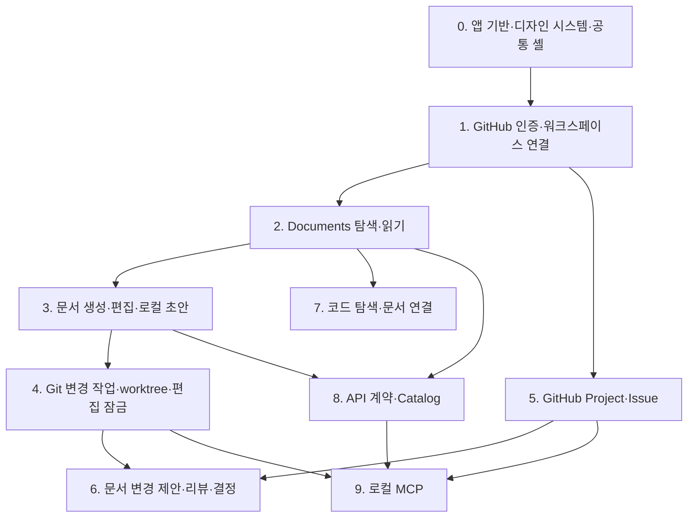

# OkHub MVP 구현 로드맵

**작성일:** 2026-07-23
**기준 문서:** `docs/product/features.md`, `docs/product/use-cases.md`, `docs/product/screens.md`, `docs/product/design-system.md`, `docs/architecture/system-design.md`

## 목표

Git의 OKF Markdown을 지식 원본으로 유지하면서, 두 명의 개발자가 GitHub 화면을 오가지 않고 문서 작성·변경 제안·리뷰·Issue 진행을 한 데스크톱 앱에서 처리할 수 있는 MVP를 단계적으로 만든다.

## 범위 원칙

- Hub 애플리케이션 저장소와 프로젝트별 OKF 지식 저장소를 분리한다.
- 앱은 한 번에 OKF 지식 저장소 하나만 현재 워크스페이스로 연다.
- 서버 또는 팀 공유 애플리케이션 DB를 두지 않는다. 재생성 가능한 기기별 검색 캐시는 허용한다.
- 팀 공유 상태는 Git과 GitHub가, 기기별 경로·화면 설정은 로컬 저장소가 소유한다.
- GitHub 온라인 변경은 요청 성공 뒤에만 완료로 표시하고 초기 MVP에는 오프라인 outbox를 두지 않는다.
- 각 단계는 독립적으로 실행·테스트·검토할 수 있어야 하며, 다음 단계가 이전 단계의 미완성 UI에 의존하지 않게 한다.
- 미결정 제품 사항은 해당 단계에 들어가기 전에 결정하고, 임시 데이터 모델을 영구 모델처럼 구현하지 않는다.

## 단계와 의존 관계

## 0. 앱 기반·디자인 시스템·공통 셸

### 결과

- Tauri 2 + React + TypeScript 앱이 macOS와 Windows 빌드 구조를 갖춘다.
- `Home / Documents / Project / Settings` 공통 셸과 접을 수 있는 사이드바가 동작한다.
- Aqua Mint, Pretendard, Lucide, Default/Compact 밀도를 토큰과 primitive로 구현한다.
- 표시 밀도를 기기 로컬 설정에 저장한다.
- component preview에서 primitive와 양쪽 밀도를 검증할 수 있다.

### 완료 기준

- 단위·컴포넌트 테스트, 웹 프론트엔드 빌드와 Tauri Rust 검사가 통과한다.
- 브라우저 개발 모드와 Tauri 창에서 같은 공통 셸이 열린다.
- 디자인 토큰을 우회한 임의 Primary 색상이나 control 높이가 없다.

### 상세 계획

- `docs/superpowers/plans/2026-07-23-foundation-design-system-shell.md`

## 1. GitHub 인증·워크스페이스 연결

### 결과

- GitHub Device Flow 로그인과 OS 보안 저장소 토큰 보관
- 기존 GitHub OKF 저장소 선택
- 기존 로컬 clone 연결 또는 지정 경로 clone
- `.okf/workspace.yml` 검증 및 안전한 초기화
- 기기별 현재 저장소 경로 저장
- 연결 뒤 Home 진입과 Settings에서 연결 교체

### 핵심 경계

- Hub는 GitHub 원격 저장소를 생성하지 않는다.
- 빈 원격은 기본 브랜치 초기 커밋, 기존 내용이 있는 저장소는 `okf/init-workspace` Draft PR을 사용한다.
- 토큰·로컬 절대 경로를 `.okf/workspace.yml`에 쓰지 않는다.

### 진입 전 결정

- GitHub App 등록 주체와 client ID 배포 방식
- OS 보안 저장소용 Tauri plugin 선택
- `.okf/workspace.yml` v1의 정확한 YAML schema

## 2. Documents 탐색·읽기

### 결과

- 문서 루트와 폴더·파일 트리 탐색
- Markdown + GFM + Mermaid 안전 렌더링
- frontmatter 속성·목차·Git history 표시
- 현재 작업 트리와 commit 이력 선택
- 제목·경로·본문 검색과 workspace별 로컬 SQLite 검색 캐시
- 문서 링크, Git 경로와 GitHub URL 복사

### 핵심 경계

- 읽기만으로 파일을 다시 쓰지 않는다.
- HTML은 기본적으로 신뢰하지 않고 명시한 Markdown 기능만 렌더링한다.
- 문서 ID는 frontmatter에서 읽고, 경로 변경 뒤에도 동일 문서를 식별한다.
- 열린 변경 제안 버전은 문서 리뷰 단계에서 연결한다.

### 진입 전 결정

- 상세 설계: `docs/superpowers/specs/2026-07-31-documents-exploration-reading-design.md`

## 3. 문서 생성·편집·로컬 초안

### 결과

- Documents 상단과 트리에서 같은 새 문서 Dialog 사용
- 9개 내장 템플릿과 `.okf/templates/` 사용자 템플릿
- 제목·파일명·저장 위치 충돌 검증
- MDXEditor 리치 편집, CodeMirror 원문 편집, react-markdown 읽기
- Mermaid 전용 편집·미리보기
- push 없이 로컬 working tree에 남는 초안과 복구 안내

### 핵심 경계

- 원본은 Markdown 하나이며 편집기 JSON을 별도 원본으로 저장하지 않는다.
- 지원하지 않는 Markdown은 변환하거나 제거하지 않고 원문 모드로 안내한다.
- frontmatter, 표, 중첩 목록, fenced code metadata, Mermaid와 링크의 왕복 보존 테스트를 통과해야 한다.

### 진입 전 결정

- 9개 템플릿의 실제 frontmatter와 본문
- Markdown 왕복 보존 허용 범위
- 파일명 정규화 규칙

## 4. Git 변경 작업·worktree·편집 잠금

### 결과

- 기존 문서 편집 시 GitHub Issue 기반 변경 작업 선택·생성
- `draft/<issue-number>-<slug>` 브랜치와 독립 worktree
- 로컬 체크포인트 commit과 온라인 복구 상태 표시
- Issue Assignee 1명을 현재 편집자로 사용하는 소프트 잠금
- 편집권 요청, 넘기기, 거절과 검수 참여 요청
- 동일 문서에 열린 변경 작업이 있으면 읽기 전용 전환

### 핵심 경계

- 같은 문서를 서로 다른 worktree에서 동시에 편집하게 하지 않는다.
- 편집권 이전은 현재 편집자가 checkpoint commit·push한 같은 브랜치를 다음 편집자가 이어받는 방식이다.
- Assignee가 0명이거나 2명 이상이면 편집자를 확정할 때까지 읽기 전용이다.
- 새 문서는 기존 문서 잠금 검사를 생략하되 동일 Git 경로 생성 충돌은 막는다.

### 진입 전 결정

- 문서 변경 Issue를 식별하는 label 또는 Issue form metadata
- 변경 작업에 포함된 문서 경로를 GitHub에 기록하는 구조
- 로컬 worktree 기본 경로

## 5. GitHub Project·Issue

### 결과

- 워크스페이스당 GitHub Project 하나 연결
- Iteration 선택, Board/List 전환과 사용자 정의 Status column
- 실제 GitHub Issue/PR만 Project item으로 표시
- Backlog의 동일 크기 카드로 새 Issue 생성
- Issue 우측 상세 panel과 전체 화면 확장
- 설명·체크리스트·속성·연결·댓글·상태 변경

### 핵심 경계

- Draft Issue는 초기 범위에서 제외한다.
- 새 Issue 추가 UI는 열린 현재 Iteration의 Backlog에만 둔다.
- 진행률 요약은 Project가 아니라 Home에서 보여준다.

### 진입 전 결정

- Project Status와 Hub 표시 순서 매핑 규칙
- Iteration이 없는 Issue의 표시 방식
- GitHub Project API 권한과 pagination 전략

## 6. 문서 변경 제안·리뷰·결정

### 결과

- 변경 브랜치에서 Draft PR 생성·갱신
- 제안 문서, 줄 단위 diff, 렌더링 Before/After 전환
- 텍스트 범위·diff 줄·Mermaid/표/코드 블록·문서 전체 댓글
- 질문 하나와 2~5개 단일 선택지를 가진 결정 요청
- 승인, 수정 요청, 재검토와 병합 뒤 확정본 반영
- Home의 확인할 요청에서 원래 문서·PR 문맥으로 이동

### 핵심 경계

- 제안 문서는 미리보기만 제공하고 리뷰 화면에서 Markdown 원문을 편집하지 않는다.
- 댓글 anchor를 찾지 못해도 삭제하지 않고 이전 버전 댓글로 표시한다.
- 리뷰와 결정은 독립 전역 메뉴가 아니라 대상 문서와 PR에 속한다.

### 진입 전 결정

- 구조화된 GitHub 댓글 schema와 versioning
- Markdown block ID 생성·유지 규칙
- GitHub review line과 렌더링 문서 anchor 사이의 매핑
- 결정 결과를 문서/history로 승격하는 기준

## 7. 코드 탐색·문서 연결

### 결과

- 연결된 코드 저장소의 파일·텍스트·심볼 검색
- 브랜치·커밋·PR별 코드와 diff 읽기
- 한 문서에서 여러 코드 위치 연결
- 코드 위치에서 관련 문서 역탐색
- IDE에서 파일·줄 열기

### 핵심 경계

- Hub에서 코드를 수정·빌드·실행·디버깅하지 않는다.
- Git에 저장 가능한 상대 경로와 commit 식별자를 공유하고 로컬 절대 경로는 기기 설정에서 해석한다.

### 진입 전 결정

- `code_refs` schema
- 심볼 검색을 ripgrep만으로 시작할지 language server를 포함할지
- macOS/Windows IDE deep-link 지원 범위

## 8. API 계약·Catalog

### 결과

- 확정한 API 원본에서 서비스·태그별 API 목록 생성
- Path, method와 `operationId` 검색
- 요청·응답 DTO, 오류 계약과 버전 diff 렌더링
- OKF 처리 케이스에서 `operationId`로 API 참조
- 선택한 원본 전략에 맞는 Postman 연계 안내

### 핵심 경계

- OKF 문서와 API 원본에 DTO schema를 중복 저장하지 않는다.
- Hub의 API 호출 기능은 원본·리뷰 흐름을 먼저 검증한 뒤 별도 범위로 판단한다.
- 코드 우선 OpenAPI를 선택하면 생성 산출물을 사람이 직접 수정하지 않는다.

### 진입 전 결정

- 현재 백엔드가 Springdoc/Swagger 코드 생성, 직접 작성 OpenAPI 또는 Postman 중 무엇을 사용 중인지
- OpenAPI 원본의 소유 저장소
- 설계 우선과 코드 우선 변경의 승인 흐름
- Postman Collection 생성·동기화 범위

## 9. 로컬 MCP

### 결과

- 앱이 꺼져 있어도 실행 가능한 STDIO MCP server
- 워크스페이스·문서·Issue·리뷰 읽기 도구
- 문서 초안·상태 변경·참조 연결·리뷰 요청 쓰기 도구
- Hub UI와 동일한 도메인 검증 및 Git/GitHub adapter 재사용
- push·merge·삭제·승인·Issue 종료 전 사용자 확인

### 핵심 경계

- 읽기와 쓰기 tool을 구분한다.
- AI 변경은 로컬 working tree 또는 제안 브랜치에 먼저 저장한다.
- MCP가 UI와 다른 파일 변환 규칙을 갖지 않는다.

### 진입 전 결정

- MCP server 프로세스와 앱 core 재사용 경계
- 사용자 확인이 필요한 명령의 handoff protocol
- tool별 허용 범위를 저장하는 로컬 설정 schema

## Home 통합 시점

Home은 별도의 대형 단계로 만들지 않고 실제 데이터가 생길 때 점진적으로 연결한다.

| 연결 단계 | Home에 추가되는 실제 정보 |
|---|---|
| 1 | 워크스페이스 연결 상태 |
| 2 | 최근 연 문서 |
| 4 | 편집권 요청, 복구가 필요한 로컬 작업 |
| 5 | 열린·진행 중·이번 주 완료 Issue, 기능 진행률, 최근 활동 |
| 6 | 검토 필요, 결정 필요, 응답 필요, 작업 시작 가능 |

## 별도 계획으로 분리할 항목

각 단계 시작 전에 `docs/superpowers/plans/`에 단계별 구현 계획을 작성한다. 단계 계획은 다음을 포함해야 한다.

- 정확한 파일 구조와 public interface
- Git/GitHub 실패와 재시도 상태
- TDD 순서와 fixture
- macOS/Windows 차이
- 보안·접근성·Markdown 보존 검증
- 사용자 승인 전에는 commit하지 않는 이 저장소의 로컬 규칙

## MVP 완료 정의

첫 팀 사용 가능한 MVP는 0~7단계가 완료되었을 때로 정의한다. 이 시점에는 문서 작성·변경 제안·리뷰·Issue 진행과 관련 코드 읽기를 한 화면에서 처리할 수 있다. API Catalog는 현재 팀의 API 원본을 확정한 뒤 포함하고, MCP는 Hub의 도메인 명령과 권한 경계가 안정된 다음 배포하는 후속 단계로 둔다.
