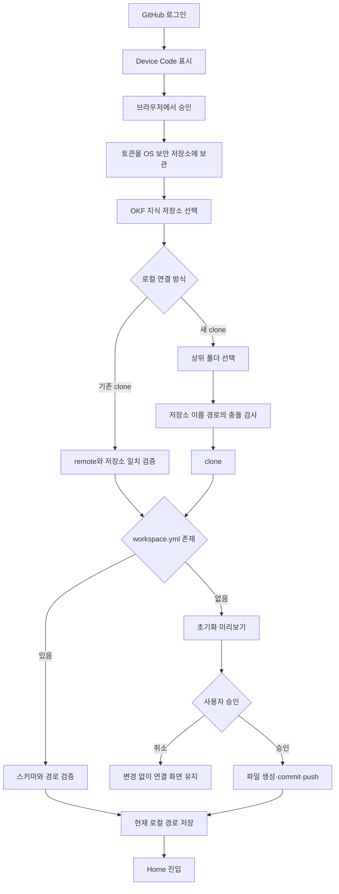

# GitHub 인증과 OKF 워크스페이스 연결 설계

**작성일:** 2026-07-25
**대상 단계:** `OkHub MVP 구현 로드맵`의 1단계
**상태:** 승인

## 1. 목표

OkHub를 처음 실행한 사용자가 GitHub에 로그인하고, 기존 OKF 지식 저장소를 선택한 뒤, 로컬 clone과 안전하게 연결할 수 있게 한다. 연결한 저장소에 워크스페이스 설정이 없으면 변경 내용을 먼저 보여주고 사용자의 명시적 승인 뒤에만 초기화한다.

이 단계가 완료되면 사용자는 연결된 단일 워크스페이스의 Home에 진입할 수 있다. 문서 탐색·편집, GitHub Project Board, 문서 변경 작업은 후속 단계에서 구현한다.

## 2. 저장소 경계

Hub 애플리케이션 저장소와 프로젝트별 OKF 지식 저장소는 분리한다.

```text
okf-knowledge-hub
└─ 재사용 가능한 Hub 애플리케이션
   ├─ React / Tauri 코드
   ├─ GitHub 연동 기능
   └─ Hub 자체 개발 문서

mockly-knowledge
├─ .okf/
│  ├─ workspace.yml
│  └─ templates/
└─ docs/

mockly-backend
└─ 실제 백엔드 코드

mockly-frontend
└─ 실제 프론트엔드 코드
```

- `.okf/workspace.yml`과 프로젝트 문서는 `mockly-knowledge` 같은 OKF 지식 저장소에 둔다.
- `okf-knowledge-hub`에는 다른 프로젝트의 워크스페이스 설정이나 문서를 저장하지 않는다.
- 현재 `okf-knowledge-hub/docs/`의 문서는 Hub 자체를 설계하고 개발하기 위한 내부 문서다.
- Hub 앱 하나를 여러 프로젝트에 재사용할 수 있지만, 한 번에 하나의 OKF 지식 저장소만 현재 워크스페이스로 연다.
- Hub는 GitHub 원격 저장소를 생성하지 않는다. 저장소가 필요하면 GitHub에서 생성하고 OkHub GitHub App의 접근 대상에 추가한 뒤 Hub로 돌아온다. Hub는 창이 다시 활성화되면 접근 가능한 저장소를 자동으로 다시 확인한다.

## 3. 범위

### 포함

- 공개 배포 가능한 GitHub App의 Device Flow 로그인
- 만료되는 GitHub 사용자 토큰과 Refresh Token의 안전한 보관·갱신
- GitHub App이 접근할 수 있는 기존 저장소 조회와 선택
- 기존 로컬 clone 연결
- 사용자가 선택한 상위 폴더 아래로 새 clone 생성
- `.okf/workspace.yml` v1 읽기와 검증
- 최소 OKF 워크스페이스 초기화 미리보기·승인·반영
- 기기별 현재 워크스페이스 경로 저장
- 연결 실패 진단과 안전한 재시도
- Settings에서 현재 연결을 다른 OKF 지식 저장소로 교체할 수 있는 기반

### 제외

- GitHub 저장소 생성
- 여러 워크스페이스를 동시에 열거나 최근 워크스페이스 목록을 제공하는 기능
- 문서 탐색·편집·렌더링
- GitHub Project Board와 Issue 조작
- 문서 변경용 Issue 잠금·branch·worktree
- 오프라인 GitHub 작업 outbox
- 워크플로 규칙의 사용자 정의

## 4. 핵심 결정

### 4.1 GitHub App

- GitHub App은 `Mockly-Company` 조직이 소유한다.
- 다른 사용자와 조직도 설치할 수 있는 공개 GitHub App으로 배포한다.
- 공식 GitHub App Client ID를 앱에 포함한다.
- 개발·자체 호스팅 빌드는 Client ID를 설정으로 대체할 수 있다.
- 데스크톱 앱에는 Client Secret을 포함하지 않는다.
- 로그인에는 GitHub App Device Flow를 사용한다.
- 기본 사용자 Access Token의 만료를 허용하고 Refresh Token으로 자동 갱신한다.
- Device Flow로 발급한 사용자 토큰은 GitHub의 예외 규칙에 따라 Client Secret 없이 갱신한다.
- GitHub App 설치 시 최소 권한을 위해 `Only select repositories`를 기본으로 권장한다. 사용자가 원하면 `All repositories`를 선택할 수 있지만 기본 안내로 제시하지 않는다.

### 4.2 보안 저장소

- Access Token과 Refresh Token은 Rust 계층만 다룬다.
- macOS Keychain과 Windows Credential Store를 사용하는 OS 네이티브 credential adapter에 저장한다.
- React WebView에는 원본 토큰을 반환하지 않는다.
- 토큰을 Git remote URL, 명령행 인자, 로그, YAML 또는 일반 로컬 설정 파일에 기록하지 않는다.
- 로그아웃은 보안 저장소의 자격 증명을 삭제하지만 기존 로컬 clone은 삭제하지 않는다.

### 4.3 로컬 clone 위치

새로 clone할 때 사용자가 상위 폴더를 선택한다. Hub는 그 아래에 GitHub 저장소 이름과 같은 하위 폴더를 만든다.

```text
사용자가 선택: ~/Documents/OkHub
저장소 이름: mockly-knowledge
최종 경로: ~/Documents/OkHub/mockly-knowledge
```

- 같은 이름의 경로가 없으면 clone한다.
- 같은 이름의 폴더가 이미 있으면 덮어쓰지 않는다.
- 기존 Git clone이면 원격 저장소 일치 여부를 확인한 뒤 기존 clone 연결을 제안한다.
- Git clone이 아니거나 다른 원격 저장소면 다른 상위 폴더를 선택하도록 안내한다.
- 앱 데이터의 숨김 폴더나 고정 `~/OkHub` 경로를 기본값으로 강제하지 않는다.

### 4.4 공유 설정과 기기 설정

팀이 함께 사용해야 하는 설정은 OKF 지식 저장소의 `.okf/workspace.yml`에 저장한다.

- 워크스페이스 ID와 이름
- 문서 루트
- 연결된 코드 저장소
- 선택적으로 연결한 GitHub Project 하나

기기에만 의미가 있는 정보는 앱의 로컬 설정에 저장한다.

- 현재 연결된 OKF 지식 저장소의 절대 경로
- 표시 밀도 같은 UI 설정
- 진행 중인 연결 화면의 비민감 상태

인증 토큰은 로컬 설정과 분리하여 OS 보안 저장소에만 저장한다.

## 5. 아키텍처

React는 화면과 사용자 선택을, Rust는 인증·GitHub·Git·파일 시스템 경계를 담당한다.

```text
React UI
├─ GitHub 로그인 화면
├─ OKF 저장소 선택
├─ 로컬 연결·clone 위치 선택
├─ 초기화 미리보기
└─ 연결 완료·오류 안내
        │
        │ 좁은 Tauri command / event API
        ▼
Rust 연결 계층
├─ AuthService
├─ GitHubService
├─ RepositoryService
├─ WorkspaceService
└─ LocalSettingsService
        │
        ▼
Adapters
├─ GitHub API
├─ OS Credential Store
├─ Git
├─ File System
└─ Device-local Settings
```

### 5.1 React UI

- 화면 단계, 입력값, 공개 가능한 진행 상태만 관리한다.
- GitHub 인증 코드와 인증 페이지 URL은 표시하지만 토큰은 받지 않는다.
- commit·push를 포함하는 초기화는 미리보기와 승인 화면을 거쳐야만 호출한다.
- 이전 단계로 돌아가도 이미 선택한 공개 상태를 유지한다.

### 5.2 AuthService

- Device Code를 요청하고 polling을 수행한다.
- Access Token과 Refresh Token을 OS 보안 저장소에 저장한다.
- 만료 전에 토큰을 갱신한다.
- 갱신이 실패하면 저장소 선택을 임의로 지우지 않고 재로그인 상태로 전환한다.
- UI에는 `signed_out`, `waiting_for_user`, `authenticated`, `reauthentication_required` 같은 공개 상태만 제공한다.

### 5.3 GitHubService

- 로그인한 사용자의 공개 프로필과 GitHub App 설치 정보를 확인한다.
- 로그인한 사용자와 GitHub App이 모두 접근할 수 있는 저장소만 설치 계정·조직별로 조회한다. 사용자의 전체 저장소나 GitHub의 모든 공개 저장소를 목록에 섞지 않는다.
- 선택한 저장소의 안정적인 ID, 현재 `owner/name`, 기본 브랜치와 비어 있는지 여부를 확인한다.
- 선택한 GitHub Project의 안정적인 ID, 소유자와 번호를 확인한다.
- API 호출마다 AuthService에서 유효한 토큰을 받고 원본 토큰을 결과에 포함하지 않는다.

### 5.4 RepositoryService

- 폴더가 Git 저장소인지 확인한다.
- GitHub 저장소 ID와 remote 정보를 비교하여 올바른 clone인지 검증한다.
- 새 clone 경로를 계산하고 사전에 충돌을 검사한다.
- clone, fetch, commit과 push의 결과를 구조화하여 반환한다.
- Git 인증 정보는 작업 중 메모리에서만 주입하고 remote URL이나 로그에 남기지 않는다.
- 기존 사용자의 변경을 덮어쓰거나 강제 push하지 않는다.

### 5.5 WorkspaceService

- `.okf/workspace.yml`을 읽고 v1 스키마를 검증한다.
- 문서 루트가 저장소 밖을 가리키지 않는지 확인한다.
- 저장소 `key`의 중복과 기존 문서 참조 오류를 검사한다.
- 알 수 없는 필드는 보존한다.
- 설정이 없으면 생성할 파일, 내용, 대상 Git branch와 원격 반영 방식을 미리보기로 만든다.
- 사용자의 승인 뒤에만 RepositoryService를 통해 변경을 반영한다.

### 5.6 LocalSettingsService

- 현재 연결된 OKF 지식 저장소의 절대 경로를 기기에 저장한다.
- 최근 워크스페이스 목록은 저장하지 않는다.
- 앱을 다시 열 때 저장된 경로를 검증하고 정상이라면 Home으로 이동한다.
- 폴더가 사라졌거나 더 이상 유효하지 않으면 연결 복구 화면을 연다.

## 6. Tauri 경계

Tauri command는 기능 단위의 좁은 요청과 직렬화 가능한 공개 결과만 제공한다. 실제 이름은 구현 계획에서 코드 규칙에 맞게 확정하되 책임은 다음과 같이 분리한다.

| 경계 | 입력 | UI에 반환하는 값 |
|---|---|---|
| 인증 시작 | 프론트엔드가 발급한 작업 ID | 같은 작업 ID, 사용자 코드, 인증 URL, 만료 시각 |
| 인증 상태 | 로그인 작업 ID | 공개 상태, 사용자 프로필 또는 오류 |
| 저장소 조회 | 페이지 cursor | 저장소 ID, 이름, 소유자, 기본 브랜치 |
| 기존 clone 검사 | 사용자가 선택한 경로, 저장소 ID | 일치 여부와 진단 |
| clone | 프론트엔드가 발급한 작업 ID, 저장소 ID, 선택한 상위 경로 | 같은 작업 ID, 진행률, 최종 경로 또는 복구 가능한 오류 |
| 워크스페이스 검사 | 검증된 로컬 경로 | 설정 요약, 초기화 필요 여부, 오류 목록 |
| 초기화 미리보기 | 워크스페이스 이름 | 생성 파일과 내용, branch·push 전략 |
| 초기화 실행 | 직전 미리보기 ID와 사용자 승인 | 로컬 commit, 원격 반영, Draft PR 결과 |
| 현재 연결 저장 | 검증을 통과한 로컬 경로 | 저장 완료 여부 |

- 토큰 문자열을 받거나 반환하는 Tauri command는 만들지 않는다.
- 미리보기에는 짧은 수명의 ID를 부여한다. 실행 요청은 같은 미리보기 ID를 보내야 하며, 저장소 상태가 바뀌면 기존 미리보기를 폐기하고 다시 확인한다.
- clone과 Device Flow polling처럼 오래 걸리는 작업은 취소 가능한 작업 ID와 진행 event를 사용한다.

### 6.1 프론트엔드 발급 작업 ID

Device Flow와 clone의 작업 ID는 백엔드가 명령 처리 중 새로 만들지 않는다. 프론트엔드가 UUID v4 작업 ID를 먼저 생성하고 reducer에 소유권을 등록한 뒤, listener가 준비된 상태에서 동일한 ID를 Tauri command에 전달한다.

백엔드는 전달받은 UUID를 검증하고 활성 작업 registry에 원자적으로 등록한다. 같은 ID가 이미 활성 상태라면 새 worker를 시작하지 않고 구조화된 충돌 오류를 반환한다. command 결과와 해당 작업의 진행, 완료, 실패, 취소 event는 모두 전달받은 동일한 ID를 사용한다.

command Promise와 event listener는 서로 다른 통로이므로 도착 순서를 가정하지 않는다. 이벤트가 command 결과보다 먼저 도착해도 reducer는 이미 소유한 ID와 일치하는 event를 처리할 수 있다. 이전 작업 ID, 다른 저장소 ID 또는 다른 경로의 event는 거부한다. Provider는 raw event를 받은 직후 다음 gateway command를 호출하지 않고 reducer가 승인하여 만든 상태를 기준으로 후속 작업을 시작한다.

이 계약에서는 작업 ID 공개를 기다리기 위한 auth/clone pre-publication buffer가 필요하지 않다. 무제한 event buffer를 두지 않으며, Provider에 별도의 last-action 또는 임시 소유권 상태를 만들지 않는다.

## 7. 최초 연결 흐름



### 7.1 GitHub 로그인

1. Rust가 Device Code와 사용자 코드를 요청한다.
2. React는 인증 URL, 사용자 코드와 남은 시간을 보여준다.
3. 사용자가 브라우저에서 GitHub App을 승인한다.
4. Rust가 토큰을 수신하고 OS 보안 저장소에 저장한다.
5. React에는 로그인한 계정의 공개 정보만 반환한다.

### 7.2 저장소 선택

1. 로그인한 사용자와 GitHub App이 모두 접근할 수 있는 저장소만 설치 계정·조직별로 보여준다.
2. 사용자는 이미 만들어진 OKF 지식 저장소를 고른다.
3. 원하는 저장소가 없다면 `GitHub에서 새 저장소 만들기`와 `GitHub App 저장소 권한 관리`를 별도의 행동으로 제공한다.
4. 사용자는 GitHub에서 저장소를 만든 뒤, `Only select repositories` 설치라면 해당 저장소를 App의 접근 대상에 추가한다.
5. 사용자가 Hub로 돌아와 창이 다시 활성화되면 목록을 자동 재조회한다. `목록 새로고침`은 자동 확인이 실패했거나 즉시 다시 확인하려는 경우의 보조 기능으로만 제공한다.
6. Hub는 선택한 저장소의 ID, 현재 이름, 기본 브랜치와 콘텐츠 유무를 다시 확인한다.

### 7.3 로컬 연결

#### 기존 clone

1. 사용자가 폴더를 선택한다.
2. Hub가 Git 저장소, remote와 선택한 GitHub 저장소의 일치 여부를 확인한다.
3. working tree에 사용자 변경이 있어도 읽기 연결 자체는 허용한다.
4. 워크스페이스 초기화처럼 쓰기가 필요한 작업은 기존 변경을 건드리지 않도록 중단하고 정리 또는 새 clone을 안내한다.

#### 새 clone

1. 사용자가 상위 폴더를 선택한다.
2. Hub가 `{상위 폴더}/{저장소 이름}`을 계산한다.
3. 경로가 비어 있는지 검사하고 clone한다.
4. clone에 실패하면 불완전한 폴더의 위치와 안전한 재시도·정리 방법을 안내한다. 자동 삭제하지 않는다.

### 7.4 워크스페이스 확인과 초기화

- `.okf/workspace.yml`이 있으면 스키마와 참조를 검증한다.
- 설정이 없으면 다음 최소 파일을 제안한다.

```text
.okf/workspace.yml
.okf/templates/.gitkeep
docs/.gitkeep
```

- 완전히 빈 원격 저장소는 기본 브랜치의 최초 commit으로 초기화한다.
- 기존 콘텐츠가 있는 저장소는 `okf/init-workspace` branch에 commit·push하고 Draft PR을 만든다.
- 미리보기는 생성 파일, 전체 내용, commit 대상, branch와 원격 반영 방식을 보여준다.
- `워크스페이스 초기화` 실행은 미리보기에 표시된 변경의 commit·push에 대한 명시적 승인이다.
- 승인 뒤 저장소 상태가 달라졌다면 실행하지 않고 새 미리보기를 요구한다.

## 8. `.okf/workspace.yml` v1

### 8.1 예시

```yaml
schema_version: 1

workspace:
  id: "89bf04ef-df57-4a76-b10a-b33107d8a6c2"
  name: "Mockly"

documents:
  roots:
    - path: "docs"

repositories:
  - key: "backend"
    label: "Mockly API 서버"
    github:
      id: "R_kgDOExampleBackend"
      full_name: "Mockly-Company/mockly-backend"

  - key: "frontend"
    label: "Mockly 웹"
    github:
      id: "R_kgDOExampleFrontend"
      full_name: "Mockly-Company/mockly-frontend"

github:
  project:
    id: "PVT_kwDOExample"
    owner: "Mockly-Company"
    number: 3
```

GitHub Project를 연결하지 않았다면 `github.project`를 생략한다. 연결한 코드 저장소가 없다면 `repositories`는 빈 배열을 사용한다.

### 8.2 필드 규칙

| 필드 | 규칙 |
|---|---|
| `schema_version` | 정수 `1`, 필수 |
| `workspace.id` | 초기화 시 생성한 UUID v4, 필수 |
| `workspace.name` | 화면 표시명, 비어 있지 않은 문자열 |
| `documents.roots` | 한 개 이상, 저장소 내부 상대 경로만 허용 |
| `repositories[].key` | 문서 참조용 안정 식별자, 워크스페이스 내 고유 |
| `repositories[].label` | 화면 표시명, 워크스페이스 내 고유 |
| `repositories[].github.id` | GitHub의 안정적인 GraphQL Node ID |
| `repositories[].github.full_name` | 현재 `owner/name`, 표시와 진단용 |
| `github.project.id` | GitHub Project v2의 안정적인 GraphQL Node ID |
| `github.project.owner` | 현재 사용자 또는 조직 login |
| `github.project.number` | 소유자 범위의 Project 번호 |

`workspace.id`는 저장소 경로나 이름이 바뀌어도 워크스페이스를 식별한다. 초기화 시 UUID v4로 생성하고 복제 저장소를 별도 워크스페이스로 만들 때만 새 ID를 발급한다.

### 8.3 `key`와 `label`

`key`는 Hub와 문서 참조가 사용하는 안정적인 내부 식별자이고, `label`은 사용자 화면에 표시하는 이름이다.

```yaml
- key: "backend"
  label: "Mockly API 서버"
```

문서 연결은 `key`를 사용한다.

```yaml
code_links:
  - repository: "backend"
    path: "src/map/MapSearchService.kt"
```

- `label`은 Settings나 YAML에서 자유롭게 변경할 수 있다.
- `key`도 사용자가 YAML에서 변경할 수 있지만 기존 문서 참조에 영향을 준다.
- Hub UI에서 `key`를 변경하면 영향받는 참조 목록을 보여주고 함께 변경하도록 제안한다.
- YAML을 직접 수정한 경우 Hub가 문서를 다시 검사하고 이전 key 참조를 깨진 연결로 표시한다.
- Hub는 사용자의 YAML을 임의로 되돌리거나 덮어쓰지 않는다.

### 8.4 호환성과 보존

- Hub가 설정을 수정할 때 알 수 없는 필드를 보존한다.
- 필드 순서와 주석은 가능한 범위에서 보존하되, v1의 의미 보존을 필수 조건으로 둔다.
- 현재 Hub가 지원하는 버전보다 높은 `schema_version`은 수정하지 않는다.
- 지원하지 않는 버전이면 업데이트 필요 상태와 실제 파일 경로를 보여준다.
- 파싱 오류, 필수 필드 누락과 참조 오류는 서로 다른 진단 코드로 제공한다.

## 9. 상태와 오류 처리

### 9.1 연결 상태

```text
Disconnected
  → Authenticating
  → RepositorySelected
  → LocalRepositoryReady
  → WorkspaceValidationRequired
  → Connected
```

인증 재요청이나 설정 오류는 단계 전체를 초기화하지 않고 마지막으로 검증된 상태에서 복구한다. 다만 저장소가 바뀌면 그 저장소에 종속된 로컬 경로와 워크스페이스 검사 결과는 폐기한다.

### 9.2 오류별 동작

| 상황 | 동작 |
|---|---|
| Device Flow 만료·거절 | 로그인만 다시 시작 |
| Access Token 만료 | Refresh Token으로 자동 갱신 |
| Refresh Token 실패 | 재로그인 요청, 저장소 선택은 비민감 상태로 유지 |
| 저장소 권한 없음 | GitHub App 설치·권한 확인 안내 |
| clone 경로 충돌 | 덮어쓰지 않고 기존 clone 검사 또는 다른 위치 선택 |
| remote 불일치 | 연결 중단, 기대 저장소와 실제 remote 표시 |
| dirty working tree에서 초기화 | 쓰기 중단, 변경 정리 또는 새 clone 안내 |
| YAML 문법 오류 | 파일과 위치를 표시하고 수정 전까지 연결 완료 차단 |
| YAML 참조 오류 | 문제 key·경로와 참조 위치 표시 |
| 더 높은 스키마 버전 | 읽거나 쓰지 않고 Hub 업데이트 안내 |
| 초기화 push 실패 | 로컬 결과를 보존하고 원격 반영 범위·재시도 안내 |
| 네트워크 단절 | 이미 연결된 로컬 문서는 후속 단계에서 읽을 수 있으나 GitHub 작업은 오프라인 표시 |
| 앱 종료 | 완료 단계만 보존, polling·clone은 자동 재개하지 않음 |

### 9.3 안전 원칙

- 자동 덮어쓰기, 자동 삭제와 강제 push를 하지 않는다.
- 실패 결과는 `무엇이 로컬에 남았는지`, `원격에 어디까지 반영됐는지`, `다음 행동이 무엇인지`를 함께 제공한다.
- 재시도는 같은 작업을 중복 반영하지 않도록 현재 Git과 GitHub 상태를 먼저 다시 확인한다.
- 긴 작업은 취소할 수 있지만, 취소가 이미 완료된 원격 변경을 되돌린다는 의미로 사용하지 않는다.

## 10. 테스트 설계

### 10.1 WorkspaceService

- 정상 v1 YAML 파싱
- UUID v4, 필수 필드와 상대 경로 검증
- 저장소 밖으로 벗어나는 `..` 경로 차단
- 중복 `key`와 `label` 진단
- 알 수 없는 필드 보존
- 지원하지 않는 스키마 버전 차단
- `key` 변경 뒤 깨진 문서 참조 탐지
- 초기화 미리보기 이후 저장소 상태 변경 시 실행 거부

### 10.2 RepositoryService

- 기존 clone과 GitHub 저장소 일치 여부
- 같은 이름 폴더의 비존재·기존 clone·일반 폴더 분기
- 빈 원격과 기존 콘텐츠 저장소 구분
- dirty working tree에서 쓰기 작업 차단
- clone·commit·push 실패 시 로컬 상태 보존
- 로그, remote URL과 공개 오류에 토큰이 없는지 확인

### 10.3 AuthService

- Device Flow의 대기·승인·거절·만료 상태
- Access Token 만료 전 자동 갱신
- Refresh Token 실패 시 재로그인 전환
- 로그아웃 시 credential 삭제
- Tauri 반환 값과 로그에 토큰이 포함되지 않는지 확인

### 10.4 React 연결 화면

- 로그인 → 저장소 → 로컬 연결 → 초기화 순서
- 이전 단계로 돌아갔을 때 선택 상태 유지
- 저장소 변경 시 종속 상태 폐기
- 초기화 승인 전 변경 command를 호출하지 않음
- 오류마다 올바른 복구 행동 표시
- 연결된 유효 경로가 있으면 재실행 시 Home 진입

### 10.5 통합 테스트

- 임시 Git 저장소를 사용한 기존 clone 연결
- 최소 OKF 워크스페이스 초기화
- 기존 콘텐츠 저장소의 `okf/init-workspace` branch 준비
- GitHub API mock을 사용한 저장소 pagination과 토큰 갱신
- 제한된 테스트 GitHub 저장소를 사용한 Device Flow 이후 clone·Draft PR smoke test

기본 CI는 mock GitHub API와 임시 로컬 Git 저장소를 사용한다. 실제 GitHub 자격 증명이 필요한 테스트는 별도 workflow로 분리하고 fork PR이나 일반 개발 환경에서 자동 실행하지 않는다.

## 11. 완료 기준

- 사용자가 GitHub Device Flow로 로그인할 수 있다.
- 토큰이 OS 보안 저장소 밖에 평문으로 남지 않고 React에 노출되지 않는다.
- 접근 가능한 기존 GitHub 저장소를 선택할 수 있다.
- 기존 clone을 검증하여 연결하거나 선택한 상위 폴더 아래로 새 clone할 수 있다.
- `.okf/workspace.yml` v1을 검증하고 오류를 구체적으로 안내한다.
- 설정이 없는 지식 저장소는 미리보기와 승인 뒤에만 최소 파일을 초기화한다.
- 빈 저장소와 기존 콘텐츠 저장소의 초기화 전략이 구분된다.
- 현재 로컬 경로를 기기에 저장하고 다음 실행에서 유효성을 다시 확인한다.
- 실패 시 기존 사용자 파일을 덮어쓰거나 삭제하거나 강제 push하지 않는다.
- macOS와 Windows에서 핵심 흐름과 보안 저장소 adapter가 검증된다.

## 12. 참고 문서

- [OkHub MVP 구현 로드맵](../plans/2026-07-23-okhub-mvp-roadmap.md)
- [유스케이스와 작업 흐름](../../product/use-cases.md)
- [화면 구성](../../product/screens.md)
- [GitHub App Device Flow](https://docs.github.com/en/apps/creating-github-apps/authenticating-with-a-github-app/generating-a-user-access-token-for-a-github-app)
- [GitHub App 사용자 토큰 갱신](https://docs.github.com/en/apps/creating-github-apps/authenticating-with-a-github-app/refreshing-user-access-tokens)
- [GitHub App 등록](https://docs.github.com/en/apps/creating-github-apps/registering-a-github-app)
