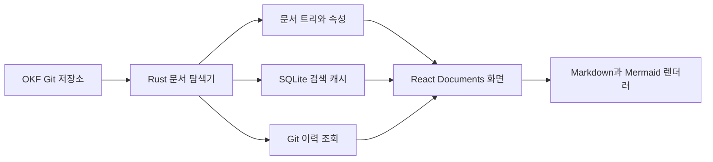

# Documents 탐색·읽기 설계

**작성일:** 2026-07-31  
**대상 단계:** `OkHub MVP 구현 로드맵`의 2단계  
**상태:** 승인

## 1. 목표

연결된 OKF 지식 저장소의 Markdown 문서를 빠르게 탐색하고 안전하게 읽을 수 있게 한다. Git의 Markdown은 계속 유일한 지식 원본이며, 문서가 수천 개여도 트리 표시가 본문 색인을 기다리지 않도록 로컬 검색 캐시를 사용한다.

이번 단계는 현재 작업 트리와 Git 커밋 이력을 읽는 범위다. 문서 생성·편집, 열린 PR의 제안 버전과 리뷰는 후속 단계에서 구현한다.

## 2. 범위

### 포함

- `.okf/workspace.yml`의 문서 루트 탐색
- 문서 루트 아래 폴더와 Markdown 파일 트리
- frontmatter 속성, 목차, GFM과 Mermaid의 안전한 렌더링
- 제목·경로·본문 검색과 결과 위치 이동
- 워크스페이스별 로컬 SQLite 검색 캐시
- 파일 추가·수정·삭제의 증분 색인
- 현재 작업 트리와 문서별 Git 커밋 이력
- 문서 링크, Git 경로와 GitHub URL 복사
- 잘못된 frontmatter와 렌더링 오류의 문서별 격리

### 제외

- Markdown 이외 파일의 Documents 표시
- 문서 생성과 편집
- 열린 PR의 제안 버전 선택과 비교
- 댓글, 승인과 변경 요청
- 코드·OpenAPI 전용 탐색기
- AI 검색, 유사어와 오타 보정
- 서버 또는 팀 공유 검색 데이터베이스

Markdown에서 다른 파일로 연결하는 것은 허용한다. YAML, JSON, OpenAPI와 코드 파일의 읽기 전용 탐색은 후속 코드·API 탐색 단계에서 다룬다.

## 3. 핵심 결정

### 3.1 문서 발견과 제목

- 설정된 문서 루트 아래의 `.md` 파일만 Documents의 문서로 인식한다.
- 문서 제목은 `frontmatter.title`을 우선하고, 없으면 확장자를 제외한 파일명을 사용한다.
- 첫 번째 H1은 제목 판별에 사용하지 않고 본문으로 취급한다.
- frontmatter가 없거나 잘못되어도 문서를 숨기지 않는다.
- 잘못된 frontmatter는 속성 영역에 오류 위치와 내용을 표시하고, 읽는 과정에서 원본을 수정하지 않는다.
- `okf_hub_id`가 없는 기존 문서도 읽고 검색할 수 있다. ID는 최초 편집 작업에서만 추가한다.

### 3.2 역할 분리



- Rust는 파일 탐색, frontmatter 추출, 파일 감시, 검색 캐시와 Git 이력을 담당한다.
- React는 트리와 검색 결과를 표시하고, 선택한 Markdown과 Mermaid를 안전하게 렌더링한다.
- React에 전체 문서 집합을 전달하지 않고 현재 문서와 필요한 검색 결과만 전달한다.

### 3.3 검색 캐시의 성격

- SQLite는 사용자의 OS 앱 데이터 폴더에 두는 삭제 가능한 로컬 캐시다.
- Git 저장소와 팀 공유 상태에는 검색 데이터를 기록하지 않는다.
- 캐시는 문서 원본이나 협업 상태가 아니며 손상되거나 형식 버전이 달라지면 폐기하고 다시 만든다.
- 인증 정보는 검색 캐시에 저장하지 않는다.
- 캐시는 워크스페이스별로 분리한다.

따라서 OkHub는 계속 서버·공유 애플리케이션 DB 없이 동작하며, Git과 GitHub가 공유 원본을 소유한다.

## 4. 데이터 구조

문서 트리에는 가벼운 요약만 사용한다.

```text
DocumentSummary
├─ path                 저장소 기준 상대 경로
├─ fileName             실제 파일명
├─ title                frontmatter.title 또는 파일명
├─ documentId?          okf_hub_id가 있을 때만
├─ frontmatterStatus    valid / missing / invalid
├─ modifiedAt
└─ size
```

검색 캐시 항목은 검색을 위해 파생한 정보와 변경 감지 자료를 갖는다.

```text
SearchIndexEntry
├─ workspaceKey
├─ path
├─ title
├─ bodyText             Markdown 표현을 제거한 검색용 텍스트
├─ modifiedAt
├─ size
├─ contentHash
└─ indexVersion
```

- `path`는 현재 작업 트리에서 문서를 여는 주소다.
- `documentId`가 있으면 경로가 바뀐 문서의 이력 연결에 사용한다.
- Markdown 원문은 문서를 열 때만 읽어 React에 전달한다.
- 검색 결과는 제목, 경로, 검색어 주변 본문과 첫 일치 위치를 반환한다.

## 5. 시작과 증분 색인

### 캐시가 있는 실행

```text
앱 시작
├─ 로컬 검색 캐시 로드
├─ 저장된 제목과 경로로 트리 우선 표시
├─ 실제 파일 목록과 metadata 확인
│  ├─ 수정 시각·크기 동일 → 기존 색인 사용
│  ├─ 수정 시각·크기 변경 → 파일을 읽고 hash 비교
│  ├─ 새 파일 → 제목 우선, 본문은 background 색인
│  └─ 삭제된 파일 → 캐시에서 제거
└─ background 동기화 완료
```

모든 파일의 hash를 시작할 때 다시 계산하지 않는다. 수정 시각이나 크기가 달라진 후보만 읽고 hash를 비교하여, 내용이 같으면 불필요한 재색인을 피한다.

### 최초 실행

- 경로와 파일명으로 트리를 먼저 표시한다.
- frontmatter 제목은 파일 앞부분을 읽어 보완한다.
- 본문 전체는 제한된 동시성으로 background 색인한다.
- 본문 색인이 끝나기 전에도 제목과 경로 검색을 제공한다.
- 화면에는 `본문 검색을 준비하는 중…`과 진행 상태를 표시한다.

### 실행 중 변경

- Hub가 문서를 저장하는 후속 단계에서도 같은 재조정 진입점에 변경을 알린다.
- 외부 IDE나 Git 작업의 추가·수정·삭제는 파일 감시로 반영한다.
- 색인 중 변경이 감지되면 현재 작업을 취소하거나 새 작업을 겹쳐 실행하지 않고 `pending` 상태 하나로 합친다.
- 현재 색인이 끝난 뒤 `pending`이 있으면 문서 루트의 metadata를 한 번 더 비교한다.
- 워크스페이스가 바뀌거나 화면이 닫히면 이전 작업의 결과를 거부한다.
- 사용자는 전체 상태를 다시 확인하는 새로고침을 실행할 수 있다.

### 파일 변경 감시 기술과 현재 구조

파일 변경 감시는 Rust의 `notify 8.2`를 사용한다. `notify::recommended_watcher()`가 실행 중인 운영체제에 맞는 파일 감시 기능을 선택하므로 OkHub가 macOS와 Windows의 저수준 파일 시스템 API를 직접 다루지 않는다. 일정 간격으로 전체 폴더를 반복 조회하는 polling 방식이 아니라, 운영체제가 전달하는 변경 이벤트를 받는 구조다.

```text
macOS / Windows 파일 시스템
└─ 파일·폴더 변경 이벤트
   └─ notify RecommendedWatcher
      └─ Tokio mpsc 채널
         └─ DocumentRuntime
            ├─ 문서 카탈로그 갱신
            ├─ SQLite FTS5 검색 캐시 갱신
            └─ 문서 상태 이벤트 발행
```

1. `.okf/workspace.yml`에 설정된 각 문서 루트를 `RecursiveMode::Recursive`로 감시한다.
2. `notify` 콜백은 파일 생성·수정·삭제·이름 변경과 폴더 변경을 수신한다.
3. 콜백에서는 파일을 읽거나 색인하지 않고 `tokio::sync::mpsc` 채널로 메시지만 전달한다.
4. `DocumentRuntime`은 짧은 시간에 연속으로 도착한 이벤트를 150ms 동안 모아 `RepositoryChanged` 하나로 전달한다. 파일 저장 한 번이 여러 운영체제 이벤트를 만들 수 있기 때문이다.
5. 기존 카탈로그 및 검색 캐시와 현재 파일 metadata를 비교한다. 수정 시각과 크기가 그대로인 문서는 본문을 다시 읽지 않고, 변경 후보만 본문과 hash를 확인해 FTS 색인을 갱신한다.
6. 결과는 Rust 내부의 `TreeChanged`, `IndexStatusChanged`, `OpenDocumentChanged`, `Failed` 이벤트로 발행한다. Tauri command와 React gateway 연결은 후속 구현 단계에서 이 이벤트를 앱 화면에 전달한다.

### Single-flight 재조정

```text
Idle
 └─ RepositoryChanged 또는 수동 새로고침 → Running

Running
 ├─ 추가 변경 없음 → Idle
 └─ RepositoryChanged → pending = true
                         └─ 현재 실행 완료 → Running 한 번 더
```

워크스페이스마다 재조정 worker는 하나만 둔다. watcher 자동 갱신과 수동 새로고침은 같은 진입점을 사용하며, 실행 중 추가 요청은 개수와 경로에 관계없이 `pending = true` 하나로 합친다. 현재 실행이 끝난 뒤 `pending`이 있으면 후속 재조정을 정확히 한 번 시작한다. 후속 실행 중 다시 변경이 발생하면 같은 규칙을 반복한다.

watcher와 런타임 사이의 정상 변경 메시지는 `RepositoryChanged` 하나다. watcher는 파일 확장자, rename 범위, 폴더 생성·삭제·이동을 정밀하게 해석하지 않는다. 런타임이 현재 문서 루트의 가벼운 metadata를 캐시와 다시 비교하므로 새 문서, 삭제된 문서, 폴더 이동도 동일한 경로로 처리한다. 실제 본문은 metadata가 달라진 후보만 읽고 hash를 비교한다.

실행 중인 재조정을 취소하고 새 세대를 겹쳐 시작하지 않는다. 이미 시작된 운영체제 파일 읽기는 제한된 동시성 안에서 끝나게 하고, 성공한 재조정만 카탈로그와 SQLite 캐시에 공개한다. 워크스페이스가 닫히거나 교체된 뒤 늦게 끝난 결과는 세션 ID로 거부한다. worker는 종료 신호를 받으면 새 재조정을 시작하지 않으며 런타임 전체의 수명을 불필요하게 연장하지 않는다.

오류가 발생하면 불완전한 결과는 공개하지 않고 `Failed`를 발행한다. 실행 중 추가 변경으로 `pending`이 설정됐다면 후속 재조정을 한 번 실행하고, 그렇지 않으면 다음 `RepositoryChanged` 또는 수동 새로고침으로 복구한다. watcher는 계속 유지한다. `BackendError`는 watcher 자체 오류를 전달하되 문서 읽기와 수동 새로고침을 막지 않는다.

## 6. 검색 동작

검색 입력은 짧게 debounce하고 이전 요청을 취소한다. 초기 버전은 한글과 영문의 단순 부분 일치를 지원하며 AI 검색, 유사어와 오타 보정은 하지 않는다.

결과 우선순위는 다음과 같다.

1. 제목 전체 일치
2. 제목 부분 일치
3. 파일 경로 부분 일치
4. 본문 부분 일치

검색 결과에는 제목, 경로와 검색어 주변 본문을 표시한다. 결과를 선택하면 문서를 열고 첫 번째 일치 위치로 이동한다. 본문 색인이 진행 중일 때는 제목과 경로 결과를 먼저 제공하고 준비 상태를 함께 알린다.

## 7. 문서 렌더링과 보안

- GFM 표, 체크박스, 취소선과 코드 블록을 지원한다.
- Markdown의 원시 HTML은 기본적으로 실행하지 않고 일반 텍스트로 처리한다.
- Mermaid fenced code block만 별도 다이어그램으로 렌더링한다.
- Mermaid가 만든 SVG도 안전성 검사를 거친 뒤 표시한다.
- 상대 `.md` 링크는 Hub 내부 문서로 이동한다.
- 외부 URL은 기본 브라우저에서 연다.
- 상대 이미지는 현재 OKF 저장소 내부의 파일만 허용한다.
- 경로 순회를 이용한 저장소 밖 접근을 차단한다.
- Markdown이나 Mermaid 실패는 해당 블록에 원문과 오류 안내를 표시한다.
- 문서 하나의 오류가 전체 Documents 화면을 중단하지 않게 문서별 오류 경계를 둔다.

## 8. 화면 상태와 흐름

- 폴더 클릭은 트리를 확장하거나 축소하고 문서 클릭은 중앙 읽기 화면을 연다.
- 이전에 선택한 문서가 존재하면 앱을 다시 열 때 복원한다.
- 선택했던 문서가 삭제됐으면 Documents 홈으로 이동하고 안내한다.
- 열린 문서가 외부에서 변경되면 내용을 갱신하고 짧은 알림을 표시한다.
- 캐시 오류가 발생해도 문서 읽기는 유지하고 background에서 캐시를 다시 만든다.
- 문서 루트가 없거나 잘못됐으면 Settings로 이동하는 복구 행동을 제공한다.
- 상세 화면은 `문서 트리 | 읽기 캔버스 | 접을 수 있는 문맥 패널` 구조를 유지한다.
- 문맥 패널의 `개요`에는 문서 속성을 먼저, 목차를 그 아래에 표시한다.

## 9. Git 이력

- 첫 구현의 현재 버전은 체크아웃된 branch의 작업 트리다.
- History 패널을 열 때만 해당 문서의 이력을 조회한다.
- 최근 20개 commit을 먼저 가져오고 사용자가 요청하면 추가 조회한다.
- commit을 선택하면 해당 시점의 문서를 읽기 전용으로 표시한다.
- 과거 버전임을 명확히 표시하고 현재 문서로 돌아가는 행동을 제공한다.
- `okf_hub_id`가 있으면 경로가 바뀐 이전 이력을 동일 문서로 연결한다.
- ID가 없으면 Git rename 감지와 경로 이력으로 가능한 범위까지 추적한다.
- 열린 PR과 제안 버전은 문서 리뷰 단계에서 추가한다.

## 10. 오류와 복구

- 읽을 수 없는 파일은 해당 트리 항목에만 오류를 표시한다.
- 잘못된 frontmatter에서도 가능한 본문은 계속 표시한다.
- 캐시 transaction에 실패하면 불완전한 항목을 현재 색인으로 공개하지 않는다.
- 손상되거나 구버전인 캐시는 격리하고 재생성한다.
- workspace 전환과 세션 종료에는 세션 ID를 사용해 이전 세션의 늦은 결과를 거부한다.
- 검색 캐시 장애는 문서 원본이나 Git 상태를 변경하지 않는다.

## 11. 검증 기준

- 캐시가 없는 최초 실행과 캐시가 있는 재실행
- 문서 수천 개의 트리가 본문 색인 전에 만들어지는지 확인
- 추가·수정·삭제·이름 변경의 증분 반영
- 폴더 생성·삭제·이동을 경로별 이벤트 해석 없이 metadata 재조정으로 반영
- metadata는 바뀌었지만 내용은 같은 파일의 hash 처리
- 색인 중 연속 변경을 겹친 실행 없이 후속 재조정 한 번으로 통합
- 변경되지 않은 문서 본문을 다시 읽지 않는지 확인
- 손상되거나 구버전인 캐시 재생성
- 누락·오류 frontmatter와 렌더링 오류 격리
- 위험한 HTML, SVG와 저장소 밖 상대 경로 차단
- 오래된 workspace·검색·색인 결과 거부
- 현재 문서 루트 밖의 기존 캐시 항목 비공개
- watcher 오류 후 다음 변경 또는 수동 새로고침으로 복구
- 세션 종료 후 watcher와 background worker 해제
- 제목·경로·본문 검색 우선순위와 검색 위치 이동
- Git 이력 추가 조회와 경로 변경 추적
- 읽기와 색인만으로 Markdown 파일이 다시 쓰이지 않는지 확인
